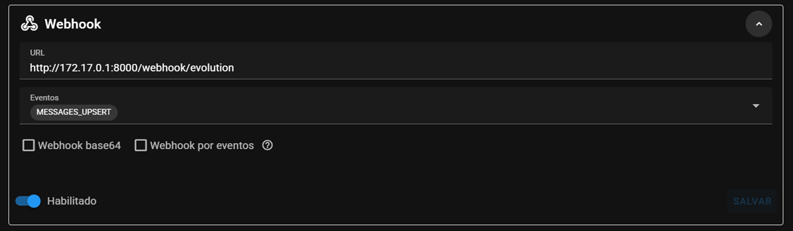
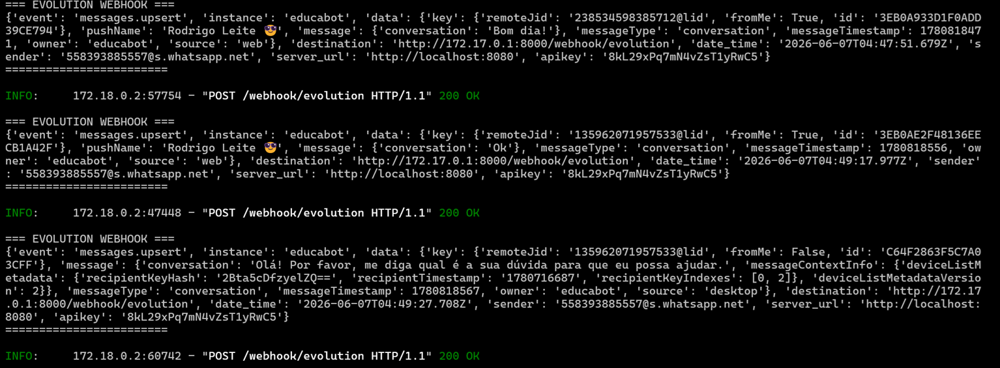

# `📡 api/`

 - A camada de entrada da aplicação.
 - É onde ficam os endpoints da API.
 - Ela **recebe requisições HTTP** e **devolve respostas HTTP**.

## Conteúdo

 - [`gestores.py`](#gestores-py)
   - [`create_manager`](#create-manager)
   - [`list_managers`](#list-managers)
 - [`health.py`](#health-py)
 - [`pedidos.py`](#pedidos-py)
 - [`webhook.py`](#webhook-py)
<!---
[WHITESPACE RULES]
- "20" Whitespace character.
--->


---

<div id="gestores-py"></div>

## `gestores.py`

> O arquivo `gestores.py` será responsável pelos endpoints relacionados aos gestores.


---

<div id="create-manager"></div>

## `create_manager`

> Endpoint responsável por cria um novo gestor no sistema.

[gestores.py](gestores.py)
```python
from fastapi import APIRouter, Depends
from sqlalchemy.orm import Session

from app.db.session import get_db
from app.models.gestor import Gestor
from app.schemas.gestor import GestorCreate, GestorResponse

router = APIRouter(
    prefix="/gestores",
    tags=["Gestores"],
)


@router.post(
    "",
    response_model=GestorResponse,
    status_code=201,
)
def create_manager(
    payload: GestorCreate,
    db: Session = Depends(get_db),
) -> Gestor:

    gestor = Gestor(**payload.model_dump())
    db.add(gestor)  # add to db
    db.commit()  # save
    db.refresh(gestor)  # refresh

    return gestor
```

<details>

<summary>Explicação Passo a Passo (Step-by-Step)</summary>

<br/>

```python
router = APIRouter(
    prefix="/gestores",
    tags=["Gestores"],
)
```

 - `APIRouter()`
   - Cria um agrupador de rotas do FastAPI.
   - É usado para organizar endpoints relacionados em módulos separados.
   - Facilita a manutenção e divisão da API.
 - `prefix="/gestores"`
   - Define um prefixo automático para todas as rotas do router.
   - Faz com que todas as URLs comecem com `/gestores`.
   - Exemplo: `@router.post("")` vira `POST /gestores`.
 - `tags=["Gestores"]`
   - Organiza as rotas na documentação Swagger/OpenAPI.
   - Cria uma seção chamada `Gestores`.
   - Ajuda a separar visualmente os endpoints por categoria.

```python
@router.post(
    "",
    response_model=GestorResponse,
    status_code=201,
)
```

* `response_model=GestorResponse`
  * Define o schema utilizado na resposta da API.
  * Garante que apenas os campos definidos em `GestorResponse` sejam enviados.
* `status_code=201`
  * Define o código HTTP retornado em caso de sucesso.
  * O código `201 Created` indica que um novo recurso foi criado.
  * É o status recomendado para operações de cadastro (`POST`).

```python
def create_manager(
    payload: GestorCreate,
    db: Session = Depends(get_db),
) -> Gestor:
```

* `payload: GestorCreate`
  * Recebe os dados enviados pelo cliente no corpo da requisição.
  * O FastAPI converte automaticamente o JSON para um objeto `GestorCreate`.
  * Também realiza validação dos dados recebidos.
* `db: Session = Depends(get_db)`
  * Recebe uma sessão do banco de dados criada pela função `get_db`.
  * Utiliza o sistema de injeção de dependências do FastAPI.
  * Permite executar operações no banco dentro da rota.
* `-> Gestor`
  * Indica que a função retorna um objeto do tipo `Gestor`.
  * É uma anotação de tipo (type hint).
  * Ajuda na documentação e na análise estática do código.

```python
gestor = Gestor(**payload.model_dump())
db.add(gestor)
db.commit()
db.refresh(gestor)

return gestor
```

* `gestor = Gestor(**payload.model_dump())`
  * Cria uma instância do modelo `Gestor`.
  * Converte os dados do schema Pydantic em um dicionário.
  * Preenche automaticamente os atributos do objeto.
* `db.add(gestor)`
  * Adiciona o objeto à sessão atual do SQLAlchemy.
  * Marca o registro para ser inserido no banco.
  * **Ainda não salva os dados definitivamente.**
* `db.commit()`
  * Confirma a transação atual.
  * Executa o `INSERT` no banco de dados.
  * Persiste as alterações de forma definitiva.
* `db.refresh(gestor)`
  * Recarrega os dados do objeto a partir do banco.
  * Atualiza campos gerados automaticamente, como o `id`.
  * Garante que o objeto esteja sincronizado com o banco.
* `return gestor`
  * Retorna o gestor recém-criado.
  * O FastAPI converte o objeto para JSON na resposta.
  * Os dados retornados seguem o `response_model` definido na rota.

</details>


---

<div id="list-managers"></div>

## `list_managers`

> Endpoint responsável por listar os gestores cadastrados no sistema.

[gestores.py](gestores.py)
```python

@router.get(
    "",
    response_model=list[GestorResponse],
)
def list_managers(
    db: Session = Depends(get_db),
) -> list[Gestor]:
    """
    List all managers.

    Returns
    -------
    list[Gestor]
        Registered managers.
    """

    return db.query(Gestor).all()
```


---

<div id="health-py"></div>

## `health.py`

> Este arquivo define um endpoint de verificação de *saúde da API (/health)*.

[health.py](health.py)
```python
from fastapi import APIRouter

router = APIRouter(
    tags=["Healthcheck"],
)


@router.get("/health")
def health_check():
    return {"status": "ok"}
```


---

<div id="pedidos-py"></div>

## `pedidos.py`

> Este arquivo define um endpoint de criação de pedidos.

[pedidos.py](pedidos.py)
```python
from fastapi import APIRouter, Depends, HTTPException
from sqlalchemy.orm import Session

from app.db.session import get_db
from app.models.gestor import Gestor
from app.models.pedido import Pedido
from app.schemas.pedido import PedidoCreate, PedidoResponse
from app.services.pedido_service import create_request

router = APIRouter(
    prefix="/pedidos",
    tags=["Pedidos"],
)


@router.post(
    "",
    response_model=PedidoResponse,
    status_code=201,
)
def create_request_endpoint(
    payload: PedidoCreate,
    db: Session = Depends(get_db),
) -> Pedido:

    gestor = (
        db.query(Gestor)
        .filter(Gestor.id == payload.gestor_id)
        .first()
    )

    if gestor is None:
        raise HTTPException(
            status_code=404,
            detail="Manager not found.",
        )

    try:
        return create_request(
            db=db,
            gestor=gestor,
            command=payload.comando,
        )
    except ValueError as exc:
        raise HTTPException(
            status_code=400,
            detail=str(exc),
        ) from exc


@router.get(
    "",
    response_model=list[PedidoResponse],
)
def list_requests(
    db: Session = Depends(get_db),
) -> list[Pedido]:
    """
    List all requests.
    """

    return db.query(Pedido).all()
```


---

<div id="webhook-py"></div>

## `webhook.py`

> O arquivo `webhook.py` será responsável por *receber os eventos enviados pela Evolution API*.

Sempre que alguém enviar uma mensagem para o WhatsApp conectado à Evolution, a Evolution fará uma requisição HTTP para sua API:

```bash
WhatsApp
    ↓
Evolution API
    ↓
POST /webhook/evolution
    ↓
FastAPI
```

Nesta etapa ainda não vamos processar comandos como:

 - `/agua`
 - `/gas`

> **NOTE:**  
> O objetivo é apenas confirmar que a comunicação entre Evolution e FastAPI está funcionando.

[webhook.py](webhook.py)
```python
from typing import Any

from fastapi import APIRouter, Request

from app.schemas.evolution import EvolutionMessage
from app.utils.evolution_parser import (
    parse_evolution_message,
)

router = APIRouter(
    prefix="/webhook",
    tags=["Webhook"],
)


def _log_message(
    message: EvolutionMessage,
) -> None:

    print("\n=== EVOLUTION MESSAGE ===")
    print(f"Phone: {message.phone}")
    print(f"Name: {message.name}")
    print(f"Text: {message.text}")
    print(f"Type: {message.message_type}")
    print(f"From Me: {message.from_me}")
    print(f"Timestamp: {message.timestamp}")
    print("=========================\n")


@router.post("/evolution")
async def evolution_webhook(
    request: Request,
) -> dict[str, str]:

    payload: dict[str, Any] = await request.json()

    try:
        message = parse_evolution_message(payload)
        _log_message(message)

    except Exception as exc:
        print("\n=== EVOLUTION PARSE ERROR ===")
        print(exc)
        print(payload)
        print("============================\n")

    return {"status": "received"}
```

<details>

<summary>Explicação Passo a Passo (Step-by-Step)</summary>

<br/>

> **⚠️ NOTE:**  
> Essa explicação é de uma versão antiga, mas vai ficar de exemplo para quem ler entender como o endpoint foi pensado.

```python
async def evolution_webhook(request: Request) -> dict[str, str]:

    ...

    return {"status": "received"}
```

No código acima nós vamos receber uma requisiçaõ `Request` e retornar um dicionário de strings na *chave* e *valor*.

```python
payload: Any = await request.json()
```

No código acima nós estamos:

1. Lendo o corpo da requisição HTTP recebida.
2. Convertendo o JSON enviado para um objeto Python (normalmente um `dict`).
3. Armazenando o resultado na variável `payload`.

> **O que significa `await`?**

A leitura do corpo da requisição é uma operação assíncrona. O `await` diz:

> **"Espere o FastAPI terminar de ler e converter o JSON antes de continuar a execução."**

Por isso a função também precisa ser:

```python
async def evolution_webhook(...)
```

> **O que é um Payload?**

**Payload** é o conteúdo principal enviado em uma requisição ou resposta.

Imagine uma carta:

* Endereço → cabeçalhos HTTP (`headers`)
* Envelope → requisição HTTP
* Carta dentro do envelope → payload

Exemplo:

```http
POST /webhook/evolution
Content-Type: application/json
```

Payload:

```json
{
  "event": "messages.upsert",
  "instance": "EducaBot",
  "message": "/gas"
}
```

Tudo que está dentro desse JSON é o **payload**.

### `Exemplo completo`

Se a Evolution API enviar:

```json
{
  "event": "messages.upsert",
  "sender": "5583999999999",
  "message": "/agua"
}
```

Quando o código executar:

```python
payload: Any = await request.json()
```

o resultado será:

```python
payload = {
    "event": "messages.upsert",
    "sender": "5583999999999",
    "message": "/agua"
}
```

E você poderá acessar os dados assim:

```python
evento = payload["event"]
telefone = payload["sender"]
mensagem = payload["message"]
```

Resultado:

```python
evento = "messages.upsert"
telefone = "5583999999999"
mensagem = "/agua"
```

### `Teste manual`

Envie um payload fake:

```bash
curl -X POST \
  http://localhost:8000/webhook/evolution \
  -H "Content-Type: application/json" \
  -d '{
    "event": "messages.upsert",
    "data": {
      "message": "Olá"
    }
  }'
```

**OUTPUT:**
```bash
{"status":"received"}
```

**TERMINAL:**
```bash
=== EVOLUTION WEBHOOK ===
{'event': 'messages.upsert', 'data': {'message': 'Olá'}}
========================

INFO:     127.0.0.1:56258 - "POST /webhook/evolution HTTP/1.1" 200 OK
```

> **NOTE:**  
> Veham que nós enviamos uma requisição `POST` para a URL `/webhook/evolution` e recebemos uma resposta `200 OK`.

### `Configurando o Webhook no painel do Evolution`

```python
print("\n=== EVOLUTION WEBHOOK ===")
print(payload)
print("========================\n")
```

Se você prestou bem atenção (e entendeu) no código acima saberá que esse `print(payload)` irá imprimir sempre um corpo de uma requisição no formato JSON no terminal.

Sabendo disso, nós vamos linkar (configurar) um webhook no painel do Evolution para ouvir tudo o que for recebido e enviado pelo telefone cadastrado nesse endpoint:

  

Na imagem acima:

 - `http://172.17.0.1:8000`
   - Se refere ao nosso IP Local.
 - `/webhook/evolution`
   - Se refere ao nosso endpoint `/webhook/evolution`.
 - `MESSAGES.UPSERT`
   - Se refere ao evento que queremos ouvir.

Agora tudo o que for digitado no número registrado será impresso no terminal:

  

</details>

---

**Rodrigo** **L**eite da **S**ilva - **rodrigols89**
